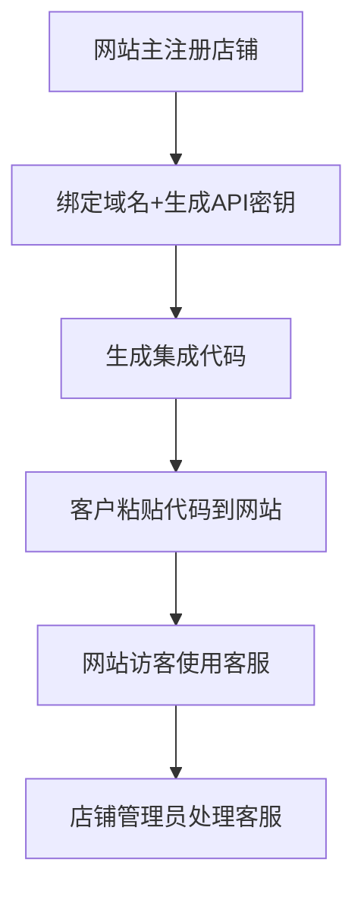

# QuickTalk 模块化架构设计

## 🎯 业务流程概述



## 🏗️ 模块化架构

### 1. 📊 数据库层 (Database Layer)
```
src/database/
├── database-core.js          // 核心数据库操作
├── shop-repository.js        // 店铺数据访问
├── message-repository.js     // 消息数据访问
├── user-repository.js        // 用户数据访问
└── conversation-repository.js // 对话数据访问
```

### 2. 🛡️ 安全层 (Security Layer)
```
src/security/
├── auth-validator.js         // API密钥验证
├── domain-validator.js       // 域名验证
├── rate-limiter.js          // 请求频率限制
└── security-logger.js       // 安全日志
```

### 3. 🏪 店铺管理层 (Shop Management Layer)
```
src/shop/
├── shop-manager.js          // 店铺注册、更新
├── api-key-manager.js       // API密钥管理
├── domain-manager.js        // 域名绑定管理
└── shop-validator.js        // 店铺数据验证
```

### 4. 🔧 集成层 (Integration Layer)
```
src/integration/
├── code-generator.js        // 集成代码生成
├── template-manager.js      // 代码模板管理
├── config-builder.js        // 配置构建器
└── sdk-updater.js          // SDK版本管理
```

### 5. 📡 客户端API层 (Client API Layer)
```
src/client-api/
├── connection-handler.js    // 连接处理 (/api/connect, /api/secure-connect)
├── message-handler.js       // 消息处理 (/api/send, /api/client/messages)
├── session-manager.js       // 会话管理
└── websocket-handler.js     // WebSocket连接
```

### 6. 💬 消息管理层 (Message Management Layer)
```
src/messaging/
├── message-service.js       // 消息业务逻辑
├── conversation-service.js  // 对话管理
├── notification-service.js  // 通知服务
└── real-time-manager.js    // 实时消息处理
```

### 7. 🎛️ 管理界面层 (Admin Interface Layer)
```
src/admin/
├── admin-api.js            // 管理员API
├── shop-admin-api.js       // 店铺管理API
├── customer-service-api.js  // 客服管理API
└── analytics-api.js        // 数据分析API
```

### 8. 🚀 应用层 (Application Layer)
```
src/app/
├── app.js                  // 应用入口
├── route-manager.js        // 路由管理
├── middleware-manager.js   // 中间件管理
└── error-handler.js        // 错误处理
```

## 🔄 数据流设计

### 客户网站集成流程
```
客户网站
├── QUICKTALK_CONFIG (API密钥+店铺ID)
├── 客服UI组件
└── SDK通信逻辑
     ↓
客户端API层
├── security/auth-validator.js (验证API密钥)
├── security/domain-validator.js (验证域名)
└── client-api/connection-handler.js (建立连接)
     ↓
消息管理层
├── messaging/message-service.js (处理消息)
├── messaging/conversation-service.js (管理对话)
└── messaging/real-time-manager.js (实时推送)
     ↓
数据库层
└── 持久化存储
```

### 管理员客服流程
```
管理员登录
     ↓
admin/admin-api.js (身份验证)
     ↓
admin/shop-admin-api.js (获取店铺数据)
     ↓
admin/customer-service-api.js (管理客服对话)
     ↓
messaging/message-service.js (发送回复)
     ↓
client-api/websocket-handler.js (推送到客户网站)
```

## 📋 核心接口定义

### 客户端API接口
```javascript
// 连接认证
POST /api/client/connect
POST /api/client/secure-connect

// 消息管理
GET /api/client/messages/:userId
POST /api/client/send

// 状态检查
GET /api/client/status/:userId
```

### 管理员API接口
```javascript
// 店铺管理
POST /api/admin/shops
GET /api/admin/shops/:shopId
PUT /api/admin/shops/:shopId
DELETE /api/admin/shops/:shopId

// 客服管理
GET /api/admin/conversations/:shopId
GET /api/admin/conversations/:conversationId/messages
POST /api/admin/conversations/:conversationId/reply

// 集成代码生成
POST /api/admin/generate-code/:shopId
```

## 🔧 配置管理

### 环境配置
```javascript
// config/environment.js
module.exports = {
    development: {
        database: './data/customer_service.db',
        port: 3030,
        cors: true,
        debug: true
    },
    production: {
        database: process.env.DATABASE_URL,
        port: process.env.PORT || 3030,
        cors: false,
        debug: false
    }
};
```

### 安全配置
```javascript
// config/security.js
module.exports = {
    apiKey: {
        length: 32,
        prefix: 'sk_',
        expiration: null // 永不过期
    },
    rateLimit: {
        windowMs: 15 * 60 * 1000, // 15分钟
        max: 100 // 每个IP最多100请求
    },
    cors: {
        credentials: true,
        optionsSuccessStatus: 200
    }
};
```

## 🎯 实现优先级

### 第一阶段：核心模块
1. ✅ 数据库层重构
2. ✅ 安全验证模块
3. ✅ 客户端API模块
4. ✅ 店铺管理模块

### 第二阶段：业务模块
1. 🔄 消息管理层优化
2. 🔄 集成代码生成器增强
3. 🔄 管理界面模块
4. 🔄 实时通信优化

### 第三阶段：增强功能
1. 📊 数据分析模块
2. 🤖 AI智能客服集成
3. 📱 移动端优化
4. 🔔 通知系统

## 📝 模块间通信规范

### 1. 依赖注入模式
```javascript
class MessageService {
    constructor(messageRepository, conversationService, notificationService) {
        this.messageRepository = messageRepository;
        this.conversationService = conversationService;
        this.notificationService = notificationService;
    }
}
```

### 2. 事件驱动模式
```javascript
// 发送事件
eventEmitter.emit('message.sent', { userId, message, shopId });

// 监听事件
eventEmitter.on('message.sent', (data) => {
    notificationService.notify(data);
});
```

### 3. 标准化响应格式
```javascript
// 成功响应
{
    success: true,
    data: { ... },
    message: '操作成功'
}

// 错误响应
{
    success: false,
    error: {
        code: 'VALIDATION_ERROR',
        message: '参数验证失败',
        details: { ... }
    }
}
```

## 🔍 监控和日志

### 访问日志
```javascript
// logs/access.log
{
    timestamp: '2025-09-12T13:30:00.000Z',
    method: 'POST',
    url: '/api/client/send',
    shopId: 'shop_xxx',
    userId: 'user_xxx',
    ip: '127.0.0.1',
    responseTime: 45,
    status: 200
}
```

### 错误日志
```javascript
// logs/error.log
{
    timestamp: '2025-09-12T13:30:00.000Z',
    level: 'ERROR',
    module: 'client-api',
    error: 'API密钥验证失败',
    details: {
        shopKey: 'sk_xxx',
        domain: 'example.com',
        ip: '127.0.0.1'
    }
}
```

这个模块化架构确保了：
- 🔧 **可维护性**：每个模块职责单一
- 🛡️ **安全性**：统一的验证和授权
- 🚀 **可扩展性**：支持功能模块化添加
- 📊 **可监控性**：完整的日志和错误追踪
- 🔄 **向后兼容**：保证现有集成代码继续工作
