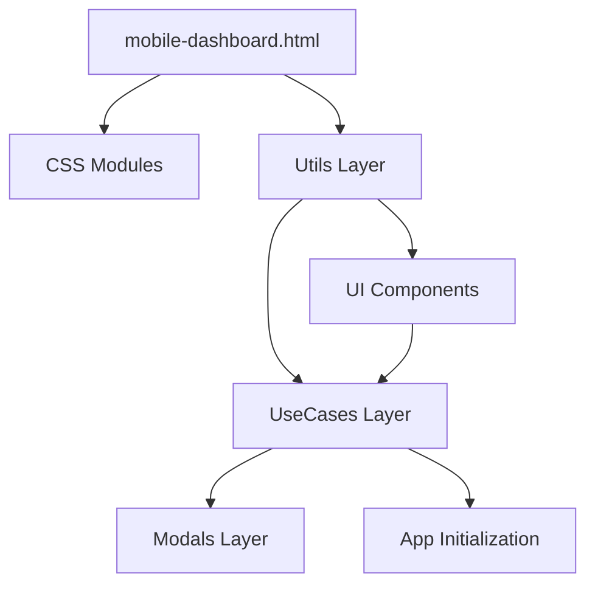

# QuickTalk 前端架构文档

## 📋 项目概览

QuickTalk 采用**高度模块化的前端架构**，经过大规模重构优化，实现了从3147行单文件到310行轻量级入口的转变。

### 🎯 架构特点
- **纯静态架构**: 无构建步骤，直接运行
- **模块化设计**: 144个JS模块 + 13个CSS模块
- **层次分明**: Utils → UseCases → UI → Modals 四层架构
- **高内聚低耦合**: 每个模块职责单一，依赖清晰

## 🏗️ 目录结构

```
static/
├── mobile-dashboard.html          # 主入口 (310行，原3147行)
├── css/                          # 样式模块 (13个文件，2737行)
│   ├── mobile-layout.css         # 移动端布局 (196行)
│   ├── shop-card-styles.css      # 店铺卡片 (332行)
│   ├── modal-styles.css          # 模态框样式 (436行)
│   ├── button-styles.css         # 按钮样式 (246行)
│   ├── chat-interface-styles.css # 聊天界面 (126行)
│   └── ...其他9个CSS模块
└── js/                           # JavaScript模块 (144个文件)
    ├── utils/                    # 工具层 (17个文件)
    ├── usecases/                 # 用例层 (58个文件)
    ├── ui/                       # UI组件层 (31个文件)
    ├── modals/                   # 模态框层 (16个文件)
    └── core/                     # 核心模块
```

## 🔧 四层架构设计

### 1️⃣ Utils 工具层 (17个模块)
**职责**: 提供通用工具函数，无业务逻辑
```javascript
// 核心工具模块
├── http-utils.js          # HTTP请求封装
├── modal-utils.js         # 模态框管理
├── user-utils.js          # 用户信息工具
├── loading-utils.js       # 加载状态管理
├── notify-utils.js        # 通知系统
├── format-utils.js        # 数据格式化
├── shop-utils.js          # 店铺工具函数
├── status-utils.js        # 状态显示工具
└── ...其他9个工具模块
```

### 2️⃣ UseCases 用例层 (58个模块)
**职责**: 业务逻辑实现，协调Utils和UI层
```javascript
// 主要业务模块分类
├── 应用初始化
│   ├── app-init.js        # 应用启动入口
│   ├── ui-bootstrap.js    # UI初始化
│   └── nav-bootstrap.js   # 导航初始化
├── 店铺管理
│   ├── shops-list.js      # 店铺列表
│   ├── shop-management.js # 店铺管理
│   ├── shop-approval.js   # 店铺审批
│   └── shop-actions.js    # 店铺操作
├── 消息系统
│   ├── message-module.js  # 消息模块核心
│   ├── message-tools.js   # 消息工具
│   └── ws-event-bridge.js # WebSocket事件桥接
├── 对话管理
│   ├── conversations-tools.js  # 对话工具
│   ├── conversation-actions.js # 对话操作
│   └── conversations-pagination.js # 对话分页
└── ...其他业务模块
```

### 3️⃣ UI 组件层 (31个模块)
**职责**: 可复用UI组件，专注视觉呈现
```javascript
// UI组件分类
├── 徽章组件
│   ├── unread-badge-component.js    # 未读徽章
│   ├── nav-badge-manager.js         # 导航徽章
│   └── shop-status-badge-adapter.js # 店铺状态徽章
├── 消息组件
│   ├── message-bubble.js            # 消息气泡
│   ├── message-media.js             # 媒体消息
│   └── typing-indicator.js          # 输入指示器
├── 交互组件
│   ├── pagination.js                # 分页组件
│   ├── search-highlight.js          # 搜索高亮
│   └── scroll-to-bottom.js          # 滚动控制
└── ...其他UI组件
```

### 4️⃣ Modals 模态框层 (16个模块)
**职责**: 模态框逻辑，集成UI和业务逻辑
```javascript
// 模态框模块
├── shop-details-modal.js      # 店铺详情
├── create-shop-modal.js       # 创建店铺
├── edit-shop-modal.js         # 编辑店铺
├── admin-panel-modal.js       # 管理面板
├── activation-modal.js        # 激活支付
├── integration-code-modal.js  # 集成代码
├── promotion-modal.js         # 推广赚钱
└── ...其他9个模态框
```

## 📊 重构成果

### 文件大小对比
| 指标 | 重构前 | 重构后 | 优化率 |
|------|--------|--------|--------|
| HTML文件 | 3147行 | 310行 | **90.2%** ⬇️ |
| 内联CSS | 2600+行 | 0行 | **100%** ⬇️ |
| 冗余注释 | 225行 | 0行 | **100%** ⬇️ |
| 重复代码 | 12处 | 0处 | **100%** ⬇️ |

### 模块化收益
- ✅ **可维护性**: 每个模块职责单一，易于定位和修复
- ✅ **可复用性**: UI组件可在多个页面复用
- ✅ **可测试性**: 模块独立，便于单元测试
- ✅ **协作友好**: 多人可并行开发不同模块

## 🔄 依赖关系

### 加载顺序
```
1. CSS样式模块 (13个) → 样式基础
2. Utils工具层 (17个) → 基础工具
3. Core核心模块 → 核心功能
4. UI组件层 (31个) → 界面组件
5. UseCases业务层 (58个) → 业务逻辑
6. Modals模态框 (16个) → 交互层
7. 应用初始化 → 启动完成
```

### 关键依赖链


## 🚀 性能特性

### 当前加载策略
- **同步加载**: 所有模块同步加载，确保依赖完整
- **模块缓存**: 浏览器自动缓存独立模块文件
- **代码分离**: 业务逻辑与UI层分离，减少重复代码

### 架构优势
1. **代码分离**: CSS/JS完全分离，便于缓存
2. **模块独立**: 144个独立模块，支持并行加载
3. **依赖清晰**: 四层架构，依赖关系明确
4. **扩展性强**: 新功能可独立模块开发

## 📝 开发规范

### 模块命名规则
- **utils**: `功能-utils.js` (如: `http-utils.js`)
- **usecases**: `业务领域.js` (如: `shop-management.js`)
- **ui**: `组件名.js` (如: `message-bubble.js`)
- **modals**: `模态框名-modal.js` (如: `edit-shop-modal.js`)

### 代码组织原则
1. **单一职责**: 每个模块只负责一个功能领域
2. **高内聚**: 相关功能集中在同一模块
3. **低耦合**: 模块间通过清晰接口通信
4. **可测试**: 纯函数设计，便于单元测试

### 新增模块指南
1. **确定层级**: 根据功能选择 utils/usecases/ui/modals
2. **遵循命名**: 按照命名规则创建文件
3. **声明依赖**: 在HTML中正确引入
4. **文档更新**: 更新本架构文档

## 🔍 故障排查

### 常见问题
1. **模块加载失败**: 检查HTML中的script标签路径
2. **功能异常**: 查看浏览器控制台，定位具体模块
3. **样式问题**: 检查CSS模块加载顺序
4. **依赖错误**: 确认模块间依赖关系正确

### 调试工具
- 浏览器开发者工具 → Network 标签页
- 控制台错误信息
- 模块加载时序分析

---

## 📈 版本历史

**v2.0 (2025-10-03)**: 大规模模块化重构
- ✅ CSS模块化: 2600+行内联样式外置
- ✅ 注释清理: 225行冗余注释删除  
- ✅ 重复清理: 12处重复代码去除
- ✅ 架构完善: 四层模块化架构建立
- ✅ 文件优化: HTML从3147行减至310行 (90.2%减少)

**v1.0**: 单文件架构
- 3147行HTML文件包含所有CSS/JS
- 维护困难，扩展性差

---
*文档生成时间: 2025年10月3日*
*架构版本: v2.0 - 高度模块化*